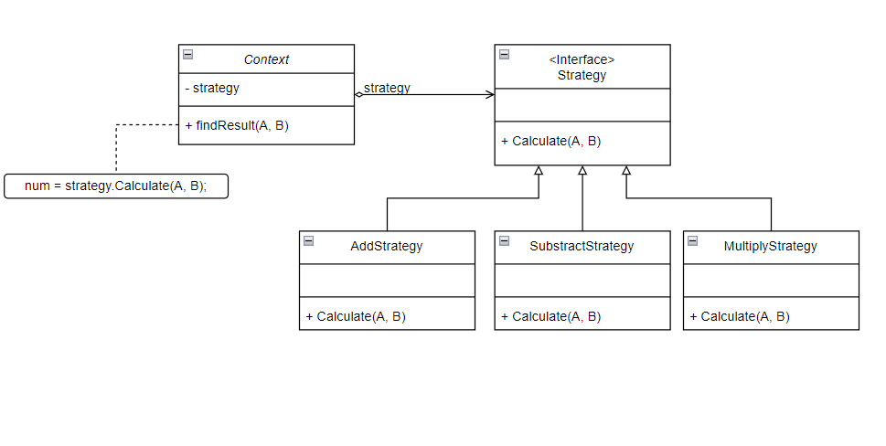
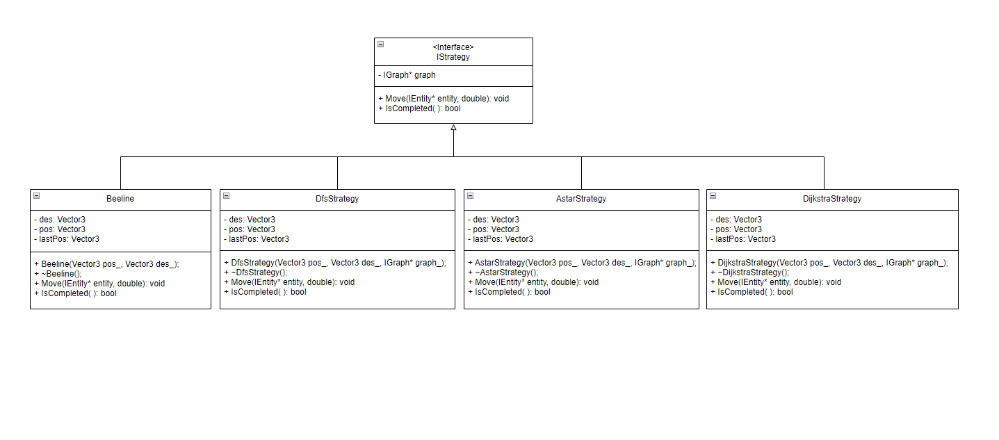

# Lab 08 Strategy Pattern Lab
_(Due **Thursday**, March 24, 2022 @ 11:59pm)_

## Introduction

This lab will introduce you to strategy design patterns that is used frequently in software design.<br>
In the lab06, you were implementing the composite factory pattern which generates drone and robot to show up on the screen. For this lab, we are implementing the movement for them to move from one place to another using strategy design pattern. The drone would check the nearest robot entity and will fly toward them and pick them up to send to their destination position.

## Retrieve Class Materials

Navigate to your repository.

```bash
% cd <path_to_directory_repo-userid>
```
Make sure that you are inside the main branch.
Run the following command and see which branch you are in.
```bash
% git branch
```
If you see the following (asterisk symbol infront of other branch instead of "main"), then you would need to switch to the main branch, otherwise skip this step. The asterisk * symbol indicate the branch you are in.
```bash
* lab07
  main
```
To switch to the main branch, run the following command. The keyword **checkout** indicate to switch/go inside to the specified existing branch.
```bash
% git checkout main
```


Pull the latest changes from the repository.

```bash
% git pull
```

Check the list of all the Git branches in this repository. Initially, a Git repository has only one branch called `main`. For this lab, we have created a new branch. A branch is a separate identical copy of the repository. This allows you to make changes on this new branch without messing with the original `main` branch.

```bash
% git branch -a
```

You'll notice that there is a new `lab08` branch along with other branches such as lab07. You can go ahead and switch over to the branch called 'lab08'.<br>

```bash
% git checkout lab08
```

## Where to work?

Go to the `project` folder at the root folder instead of the lab08 folder. You will be working and modifying the code inside this folder rather than the `labs` folder. The individual lab folders will be provided to give instructions on what to do, such as the current lab08 folder. 

```bash
% <make_sure_you_are_inside_the_root_folder(directory_repo)>
```

Make sure you are in the correct branch by running the command below. If you see ***lab08**, then you are inside the correct branch. Else, go back to the instructions provided at the beginning.
```bash
% git branch
```

Go to the project base code folder
```bash
% cd project
```
You will be working inside this folder.

## How to run the project?

If you attended workshop 3, I bet that you already know how to run the code. However, for those who either don't know or forgot how to run it, the following commands will show you how to run the visualization.

````bash
# Locate to the project base code folder first.
# Clean the project
% make clean

# Build the project
% make -j

# Run the project (./build/web-app <port> <web folder>)
% ./build/bin/transit_service 8081 apps/transit_service/web/
````
Navigate to http://127.0.0.1:8081 and you should see a visualization. <br>
Navigate to http://127.0.0.1:8081/schedule.html and you should see a a page to schedule the trips.
To view the entities, click on the right top of the visualization page (not the schedule page) and choose the entity to view such as drone or (robot name) that you give in the schedule page.


## The Strategy Pattern

The Strategy Pattern is part of the Gang of Four's Behavioral Patterns. The strategy pattern defines a family of algorithms, encapsulates each one, and makes them interchangeable. Strategy lets the algorithm vary independently from clients that use it. 

<p align="center"> </p>

A great example of the strategy pattern is a standard calculator. In this analogy the concrete classes would consist of addition, subtraction, multiplication, and division. The strategy would be an interface named operation. In this context, you could have a vector of numbers called operands and a vector of operator class pointers to calculate the inputted algorithm. 

## Different Drone Movement Strategies

<p align="center"> </p>
(Click the picture above to view full picture with good resolution)

Our program will allow use to choose **four** type of  movement strategies: beeline, Astar, Dijkstra, and . These algorithms are separate but do however take in similar parameters: Position, Destination, and route graph. 

**Beeline** will move from one point to another in linear movement direction. (We have provided this function)<br>
**Astar** will uses Astar path algorithm to move from current position point to the destination position.<br>
**Dijkstra** will uses Dijkstra path algorithm to move from current position point to the destination position.<br>
**DFS** will uses DFS path algorithm to move from current position point to the destination position.<br>

*Note*: You do not need to implement these routing algorithm, we had already provide the routing algorithm for you. All you need to do is to call these routing algorithm and use it with strategy design pattern.

See the files below for Routing Algorithms
````bash
<repo_dir>/project/libs/routing/include/routing/
````

See the file below for example on how to call/use the algorithm
````bash
<repo_dir>/project/apps/graph_viewer/src/main.cc
````

# What to do?
For this lab, you will be refactoring and adding new code to the project to implement the **Strategy Design pattern** that you seen above.
As of the moment, the drone will only use the beeline to move around no matter what strategy is choosen from the schedule page.

- Create IStrategy class, DfsStrategy class, AstarStrategy class and DijkstraStrategy class where these classes will be used to move the entities.
- Refactor Beeline class so that it uses the Strategy design pattern.
- DfsStrategy, AstarStrategy and DijkstraStrategy will use the path that is provided by the graph to move around (See above graph_view file and beeline as an guide).
- Add some code inside the drone.cc so that when the neares robot is found, it will use that robot's provided strategy name to move the robot toward its destination.

**Note**: The drone will move toward the robot using the beeline pattern and will pick up the robot and move toward the robot's destination using the pattern that user has defined during the schedule stage.

**Hint**: *Use the UML diagram provided for strategy design pattern to get started.*

Finally, you will have the following new files in your project folder:
- IStrategy.cc/.h
- DfsStrategy.cc/.h
- DijkstraStrategy.cc/.h
- AstarStrategy.cc/.h
- Beeline.cc/.h (Refactored)
- robot.cc/.h (Refactored)
- drone.cc/.h (Refactored)

After you completed implementing the strategy design pattern, your drone and robot should be able to move using the Astar, DFS, Dijkstra, and beeline pattern.

# Submission
Show the your section TAs your final result and get checkoff for this lab.

_(Due **Thursday**, March 24, 2022 @ 11:59pm)_
