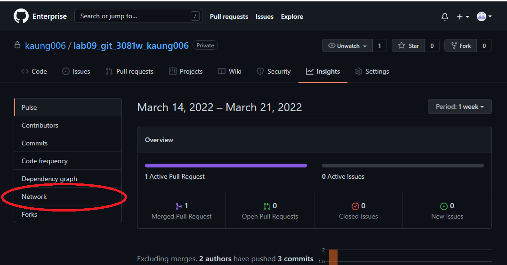

# Lab 09 Git Lab
_(Due **Thursday**, March 31, 2022 @ 11:59pm)_

## Introduction

In this assignment, you will get familiar with Git and some of its main features. Git is one of the most famous version control system that is used worldwide. By using the version control system tools, you do not need to worry about losing the data anymore and you can now share your data with peers. The assignment assumes that you are working from the command line, and we will simulate the presence of multiple users using two terminal windows. The rest of this document is divided into two parts *General Information* and *Lab Instructions*. The *General Information* section provides instructions on the background required for this lab and how to access a lab machine to complete the assignment. (If you would like to use your own machine to complete the lab, that is ok but we cannot provide troubleshooting help for errors that might be machine-related. If needed, you can find how to install Git on your machine at this [link](https://git-scm.com/book/en/v2/Getting-Started-Installing-Git).) The section *Lab Instructions* details the instructions for this lab. Finally, we suggest to read this assignment by accessing this file on GitHub.


## General Information

### Accesing a Lab Machine

For this assignment, we suggest you use a lab machine in [Keller Hall 1-262](https://cse.umn.edu/cseit/classrooms-labs/keller-hall-1-262), as Git is already installed on the machine. You can also access a lab machine remotely using the FASTX system. You can access the machine using this link https://csel-kh1262-X.cselabs.umn.edu where X is the machine identifier we provided to you at the beginning of the semester. For example, if your machine identifier is 09, you should use [https://csel-kh1262-09.cselabs.umn.edu](https://csel-kh1262-09.cselabs.umn.edu) to connect to your machine. (If you are attending in person, you do not need to remotely connect as you already have access to the machine.)

**IMPORTANT: Sometime you might not be able to log into the lab machine. One of the reasons for this issue is that you might reached your CSE Labs Account disk quota. To free space, please use these [instructions](https://cse.umn.edu/cseit/self-help-guides/disk-quota-free-your-space). (In some cases, you might need to SSH into a CSE classroom or lab machine to complete the instructions.)**

## Lab Instructions
Please also make sure to read the whole assignment before getting started and to follow the instructions we provide to the letter (e.g., use the exact commit messages provided in the assignment, rather than variations of them). If you don’t know how to accomplish a task, either consult Git's help by running `git --help <command>` or leverage online resources (there are plenty, such as this [Git cheat sheet](https://education.github.com/git-cheat-sheet-education.pdf)). If you receive an error while executing a Git command, make sure to read the error message, as Git often suggests exactly the right thing to do.

If you are not familiar with Git and feel completely lost, you can check the tutorials provided by github at [link1](https://docs.github.com/en/get-started/quickstart/hello-world), which should further get you familiar with Git’s basic concepts.

### Part A (Creating repo)
This can be done in two ways. If you'd like to create the repository on your own in command line, you are free to do so. You can find the instruction on google if you would like to use the command line to create.
The instructions below will show the steps for the other method: creating the repository through the Github interface.

1. Navigate to the [umn-csci-3081-s22](https://github.umn.edu/orgs/umn-csci-3081-s22) organization page.

2. Click on the green button on the right that says 'New'.

3. Under _repository name_, you **MUST** follow the naming convention specified in the next sentence so the TAs can grade your work correctly. 
    - Specifically name your repository **lab09_git_3081w_&lt;x500&gt;** where &lt;x500&gt; is *your* umn internet id. For example, if your UMN x500 id is abcxxx123, then your repository should be named **lab09_git_3081w_abcxxx123**.

4. **IMPORTANT**: select _private_ as the privacy setting. If you leave it as public, any other student can also see your repository (and potentially push code, delete code, etc.).

5. Select the checkbox to 'Initialize this repository with a README'. It is not necessary to specify .gitignore extensions.

6. When you select 'Create repository', your personal repository will be created on the github.umn.edu server and you will be navigated to your new repo.

Now that your repo exists on the remote server (that is, **github.umn.edu**), you will want to clone it into your local repository of your cselabs account. 

7. Click the green button on the right that says, 'Code'. Under it, ensure that HTTPS is selected and click on the copy icon on the far right. This will copy the repository reference to the clipboard. We will refer to this as the **_&lt;clone-ref&gt;_**. Now, you can clone this repo from the remote Github instance to your local workspace (on the CSELabs machine you are working on).

### Cloning Your Personal Repository 
**(Do not clone the repo unless you get to Part B)<br>**
Switch to the location that you would like to clone the repo at and open the terminal there. 
Then clone your individual repo into this directory. Replace **_&lt;clone-ref&gt;_** below with the repository reference we copied earlier (i.e. paste, typically Shift+Insert in a terminal).

    $ git clone <clone-ref>
    $ ls

**_What just happened?_** You made a new directory (i.e. folder) in your account
You copied the repo locally to your machine with `clone`. You listed the contents of
the working directory with `ls`, which should list the newly created directory
with the name of the repository which it contains. These directories function
exactly like all other linux directories. There are hidden files that track
changes to the repository.

### Part B (Push to main)
**Main** branch is where the correct and working data are stored.
This part will show you how to add files to your remote server.

1. Open a terminal window
2. Clone the repo that you just created
3. This should create a directory called `lab09_git_3081w_<x500>` (e.g., `lab09_git_3081w_abcxxx123`)
4. Go to directory `lab09_git_3081w_<x500>`
5. Make sure that the directory contains a file called `README.md`
6. Create a file called `initials.txt` (under `lab09_git_3081w_<x500>`) that contains only one line with your first and last name initials (e.g., "A K")
7. Add and commit the file to your local repo with comment "Added initials file". Note: if you want to add all the file inside current folder, use -A instead of the file names.
````
$ git add initials.txt
$ git commit -m "Added initials file" 
````
8. Push your local repo to the remote server.
````
$ git push
````
Now go back to your repo inside the [github.umn.edu](github.umn.edu). You will see the initials.txt added there.

### Part C (Branching)
Now assume that you are working with a team. You do not want to lose your code and want to store it inside the remote server but also it's not the correct data to push to the remote repo for others to see yet. This is where branching came in. By using **branch** you do not really need to care about updating the existing correct working codes (main) with your buggy incomplete code and store it on remote server. 

1. Check which branch are you currently in
    ````
    $ git branch
    ````
    If you run the command above, you would see the following in your terminal. The asterisk * indicates the branch you are currently in.
    ````
    $ git branch
    * main
    ````
    So currently you are inside the main branch.<br>

2. Create new branch called **development**
    ````
    $ git branch development
    ````
    This will create the branch named development
3. Check if the branch is created
    ````
    $ git branch
    ````
     If you run the command above, you would see the following in your terminal. Note that you will now see development and main, where there will be asterisk * infront of the main. This means you are still inside the main branch
    ````
    $ git branch
      development
    * main
    ````
4. Switch to the development branch
    ````
    $ git checkout development
    ````
5. Now check which branch are you in once again.
    ````
    $ git branch
    ````
    You will see the following, with asterisk * infront of the development.
    ````
    $ git branch
    * development
      main
    ````
    Now you are good to work on whatever you are doing.
6. Edit file `initials.txt` and add your x500 in a separate line
7. Add and commit the `initials.txt` file where the commit message can be anything
8. Push the commited files along with your branch to the remote server
    ````
    $ git push origin development
    ````
9. Now go back to your repo inside [github.umn.edu](github.umn.edu). Click on the initials.txt, you will still see your initials and not your x500. The reason for this is because you are looking in the main branch and not the branch you created and pushed to.
10. Press the button below the `<> Code` on the far left top area (see the pic blow). It will drop down the branches that the remote server has.
    <p align="center"> </p>

11. Click on the branch called `development` and click on the initials.txt
12. Now you will see the file that you added with your x500

### Part D (Merging)
Now assume that you have all your working codes in the remote server on the branch called development. You would like to update the code inside the main branch with the data inside the development branch. We will merge the development branch into the main branch. This can be done in both using CLI or Github user interface. For this lab, we will show the instruction using the user interface.
1. Click on the `Pull requests`
    <p align="center"> </p>

2. Click on the green button on the right that says 'New pull request'.
3. Now choose `developement` in the compare box
    <p align="center"> </p>
4. In here, you will be able to see which data will be delete and added. 
5. Then press on the green button on the right that says `Create pull request`
6. Now click the assignees and assign it to yourself (type your username)
    <p align="center"> </p>
7. If you are working in the groups and have collaborators, then you would want to add reviewers as well. All you have to do is click the `Reviewers` above the `Assignees` and enter their username. You will not be able to add them in for this lab since there's no collaborator present in your repo.
8. Now press `Create pull request`. The system will now check to see if there are any merging conflict. If there are no conflicts, you will see the tick icon along with `merge pull request` in green color box.
9. Click `Merge pull request`, this will tell the system to merge the development branch to the main branch
10. Now, click `Confirm merge` as a confirmation
11. It should merge the development branch into the main branch successfully. Note: Do not delete the branch for this lab as we will use this to grade some of your work.
12. Go back to the code and choose main branch
    <p align="center"> </p>
13. Click on the `initials.txt` and now you will see your x500 there. This means that the branch has been merged and updated successfully.
14. Now that you were able to merge 2 versions of "initials.txt" which had updates on different lines, try to see what happens if you make a change on the same line. Instead of adding your x500 to the next line, add to the same line as your name in the development branch. 
15. See if you can resolve the conflicts which arise. This is just a practice exercise to help you understand git better, and you don't need to include it in your submission. Try to resovle the arising conflict in VSCode or webstorm, these UIs usually come with highlights to help you find the conflicts easily. 

## Part E (Checking network flow graph)
1. You can double check whether your branch has been merged to the main or not by using the network flow graph
2. Locate to the `insights`
    <p align="center"> </p>
3. Click on the `Network`
    <p align="center"> </p>
4. You will see something like below
    <p align="center"> </p>
    This means that the development branch has been merged into the main branch. You can check all of the branches from here to see whether it has been merged or not and many more.

## Part F (Creating a Fork)
1. GitHub is a great place to find open source projects and communities and become a contributer. So, you may run into a situation where you want to contribute to a repository, for example, if you decide to participate in [Google Summer of Code](https://developers.google.com/open-source/gsoc/timeline) during your summer break. Go check it out, you can still apply!!
2. In this case, there will be a parent repository with a significantly huge and complicated codebase. For example, [OpenCV](https://github.com/opencv/opencv) which is a long time participating organization in GSOC.
3. While studying the code and contributing is something you'd spend most of your time doing, being super comfortable with git basics and concepts will help you get started!
4. An important concept in Forking a repository. Go to the link of the organization, and check the top right corner. There will be a fork button and a number next to it. This repository has been forked by over 50k coders all around the world! They have about 2k issues and 116 pull requests! 
5. Fork, is the equivalent of creating a copy of a parent repository to your github profile. It allows you to work independently on issues, and safeguards the main repo incase a contributer breaks something. This is how we end up with so many flavours of software through open source. 
6. To practice you can create a fork of our class [repository](https://github.umn.edu/umn-csci-3081-s22/shared-upstream) using the fork button.
7. It will show a popup asking you where to create the fork, and you will see your umn id. Click on that. Now if you go to your profile, you should be able to see your own copy of the project.
<p align="center"> </p>
<p align="center"> </p>
<p align="center"> </p>

8. In conclusion, in the first part of this lab, you learnt how to create a new project repository for your own project to collaborate within your own small team. This is great for university projects, and saved a LOT of time when everyone is working on different features.
9. In this part, you have learnt about collaborating on a much larger codebase by creating a copy of it, using fork! This is very helpful in the professional space, and if you ever decide to become an open source contributer to keep learning and growing as a coder!


### Final Submission

To submit your assignment, post on the Gradescope assignment "Lab09: Git" your repo url and the commit ID for your submission, which you can obtain by running `git log -1` in "terminal" after the last (successful) command OR you can access this by clicking at the actual commit ID in the git user interface ([click here to see how](pics\commitId.png)). The commit ID is the long hexadecimal number after "commit" (e.g., `27d96ac109d66d1a40631b4eacbb1d2acc0e7623`).
 
