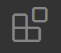
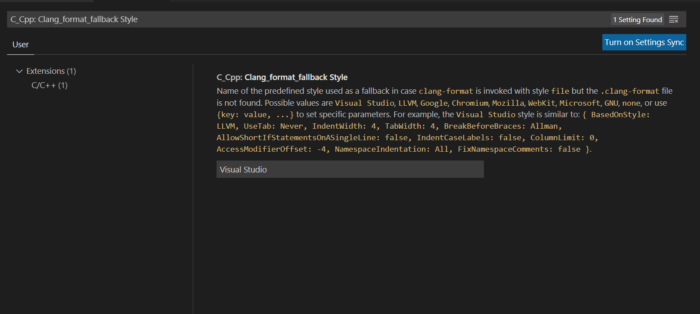

# Lab 11 Code Styling
_(Due **Thursday**, April 14, 2022 @ 11:59pm)_

## Introduction

This lab will introduce you to code styling. You will learn how to change your code so that it matches a specific code style.

## Important, please read!
We **recommand** you use the physical lab machine for this lab. SSH and Vole may **not support** the instructions that we provided for this lab. If you are using your **own local machine**, please feel free to do so, but we cannot assist you with all the installations except by providing the tools that are needed to complete this lab.<br>

Things to install if you are using your own machine
1. [Visual Studio Code](https://code.visualstudio.com/Download)
2. [Cpplint](https://github.com/cpplint/cpplint)
 

## Retrieve Class Materials

Navigate to your repository.

```bash
% cd <path_to_directory_repo-userid>
```
**Make sure** that you are inside the main branch.
Run the following command and see which branch you are in.
```bash
% git branch
```
If you see the following (asterisk symbol in front of some other branch instead of "main"), then you would need to switch to the main branch, otherwise skip this step. The asterisk * symbol indicates the branch you are in.
```bash
* lab10
  main
```
To switch to the main branch, run the following command. The keyword **checkout** indicates we want to switch to the specified and existing branch.
```bash
% git checkout main
```

Pull the latest changes from the repository.

```bash
% git pull
```

Check the list of all the Git branches in this repository. Initially, a Git repository has only one branch called `main`. For this lab, we have created a new branch. A branch is a separate identical copy of the repository. This allows you to make changes on this new branch without messing with the original `main` branch.

```bash
% git branch -a
```

You'll notice that there is a new `lab11` branch along with other branches such as lab07. You can go ahead and switch over to the branch called 'lab11'.<br>

```bash
% git checkout lab11
```

## Where to work?

Go to the `project` folder at the root folder instead of the lab11 folder. You will be working and modifying the code inside this folder rather than the `labs` folder. The individual lab folders will be provided to give instructions on what to do, such as the current lab11 folder. 

```bash
% <make_sure_you_are_inside_the_root_folder(directory_repo)>
```

Make sure you are in the correct branch by running the command below. If you see ***lab11**, then you are inside the correct branch. Else, go back to the instructions provided at the beginning.
```bash
% git branch
```

Go to the project base code folder
```bash
% cd project
```
You will be working inside this folder.

## What to do?
You will be refactoring the codes inside project/libs/transit/src folder (including math) to match the Google code style while maintaining the project structure. 

## How to make sure your code style matches the Google style?
We will be using **cpplint** program as this program follows the Google code styling guideline which is perfect for us.
1. Before everything, try to run the project itself and see whether it worked or not.
2. Make sure you are inside the **project** folder.
3. Run cpplint onto one of the src files (drone.cc)
    ````bash
    cpplint ./libs/transit/src/drone.cc
    ````
    You will see something like
    ````bash
    ./libs/transit/src/drone.cc:0:  No copyright message found.  You should have a line: "Copyright [year] <Copyright Owner>"  [legal/copyright] [5]
    ./libs/transit/src/drone.cc:2:  Include the directory when naming .h files  [build/include_subdir] [4]
    .
    .
    .
    ./libs/transit/src/drone.cc:86:  Missing space before {  [whitespace/braces] [5]
    Done processing ./libs/transit/src/drone.cc
    Total errors found: 38
    ````
    This means that there are 38 total errors that doesn't match the Google styling guide. 
4. Go into the *drone.cc* file and try to fix the errors manually.
5. Check again using the cpplint to see whether the errors are still there or not using the command below. 
    ````bash
    cpplint --filter=-legal/copyright,-build/include,-build/namespaces ./libs/transit/src/drone.cc
    ````
    The filter keyword is to filter the errors that we do not want, which in our case, we want to exclude 3 cases (legal/copyright, build/include, build/namespaces).
6. Manually checking and trying to fix the errors to match the styling guideline is very tedious. So, we would use some plugins to do this automatically.
7. We will be using Visual Studio Code editor to match the styling guideline.<br>
The following command will open current folder inside the Visual Studio Code editor. 
    ````bash
    code .
    ````
8. Press the extension icon  on the left side OR press Ctrl + Shift + X
9. Search **C/C++** in the search bar
10. Then click on the first choice (C/C++, not C/C++ Extension Pack)
11. Press install
12. Go to the setting under File tab -> Preference -> Setting
13. Search "C_Cpp: Clang_format_fallback Style"
14. You will see something like the pic below
<p align="center"><p>

15. Change the "Visual Studio" into "Google"
16. Open the file that you would like to change the code style inside the visual studio by clicking the file icon  and selecting the file to open
17. Now is time to do apply the styling automatically. Press "Ctrl + Shift + P" and find **"format document"** then press ENTER OR press "Ctrl + Shift + I" as shortcut key. This will automatically format your codes into the styling that we specify (Google style guideline)
18. Note that this will **not fix** all the guideline that is needed, however this will reduce it tremendously
19. Check again using the cpplint on the drone.cc file and see whether it reduces the errors or not.
20. Repeat the step 17 for all of the .cc files inside the project/libs/transit/src folder including math folder
21. Now check it using the cpplint on all the files by using the command below
    ````bash
    cpplint --filter=-legal/copyright,-build/include,-build/namespaces --recursive ./libs/transit/src
    ````
    The filter keyword is to filter the errors that we do not want, which in our case, we want to exclude 3 cases (legal/copyright, build/include, build/namespaces).
22. There should be some errors left which the plugin cannot fix. For those errors, you would need to manually fix it.
22. Finally, there should be only 0 errors left after you run the command from step 21. If your final errors matches this, then you have completed the lab.
    ````bash
    Done processing libs/transit/src/AstarStrategy.cc
    Done processing libs/transit/src/Beeline.cc
    Done processing libs/transit/src/CelebrationDecorator.cc
    Done processing libs/transit/src/CompositeFactory.cc
    Done processing libs/transit/src/DfsStrategy.cc
    Done processing libs/transit/src/DijkstraStrategy.cc
    Done processing libs/transit/src/DroneFactory.cc
    Done processing libs/transit/src/RobotFactory.cc
    Done processing libs/transit/src/SpinDecorator.cc
    Done processing libs/transit/src/drone.cc
    Done processing libs/transit/src/math/vector3.cc
    Done processing libs/transit/src/robot.cc
    Done processing libs/transit/src/simulation_model.cc
    ````
# Submission
Submit to the gradescope the following files (basically everything in the src folder):<br>
 - math/
   - vector3.cc
 - AstarStrategy.cc
 - Beeline.cc
 - CelebrationDecorator.cc
 - CompositeFactory.cc
 - DfsStrategy.cc
 - DijkstraStrategy.cc
 - DroneFactory.cc
 - RobotFactory.cc
 - SpinDecorator.cc
 - drone.cc
 - robot.cc
 - simulation_model.cc

_(Due **Thursday**, April 14, 2022 @ 11:59pm)
